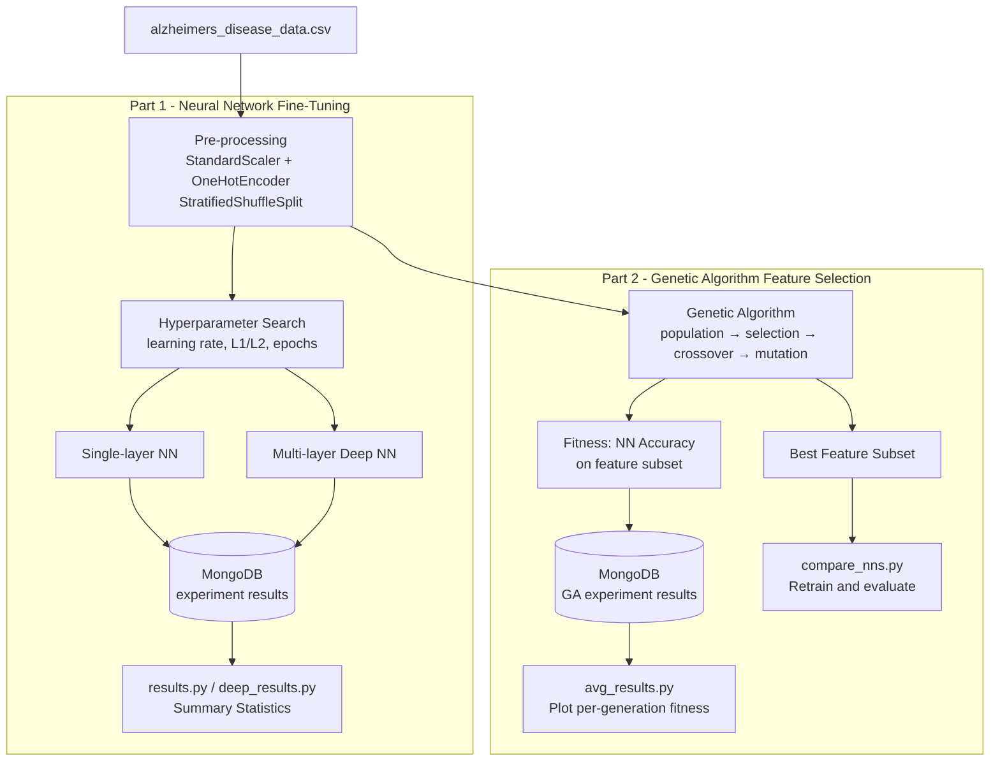

# Alzheimer's Disease Prediction and Genetic Algorithm Feature Selection

A two-part machine learning project. Part 1 fine-tunes neural networks (single-layer and multi-layer) to classify Alzheimer's disease risk. Part 2 applies a genetic algorithm to identify the optimal feature subset that maximizes model accuracy while minimizing the number of input features.

## Tech Stack

| Component | Technology |
|-----------|-----------|
| ML Framework | TensorFlow / Keras |
| Experiment Tracking | MongoDB (`pymongo`) |
| Data Processing | Pandas, NumPy, scikit-learn |
| Visualization | Matplotlib |
| GPU Acceleration | CUDA (via `numba`) |
| Dataset | `alzheimers_disease_data.csv` (tabular clinical data) |

## Project Structure

```
predicting_alzheimers/
├── alzheimers_disease_data.csv     # Raw dataset
├── best_model.keras                # Best single-layer model checkpoint
├── best_model_geneticv2.keras      # Best model from GA-selected features
├── best_split.pkl                  # Best train/test split (reproducibility)
├── part-1-neural-network/
│   ├── alzheimers_prediction.py    # Hyperparameter search + single-layer NN fine-tuning
│   ├── run.py                      # Fixed-hyperparameter run (single-layer)
│   ├── deep_run.py                 # Fixed-hyperparameter run (multi-layer)
│   ├── results.py                  # MongoDB → summary stats (single-layer)
│   ├── deep_results.py             # MongoDB → summary stats (multi-layer)
│   ├── assignment.pdf              # Original assignment specification
│   ├── results/                    # Loss & accuracy plots (L2 regularization)
│   └── results-l1/                 # Loss & accuracy plots (L1 regularization)
└── part-2-genetic-algorithm/
    ├── genetic_algo.py             # Genetic algorithm for feature selection
    ├── run_experiments.py          # Batch GA experiment runner
    ├── avg_results.py              # Fetch GA results from MongoDB + plot
    ├── compare_nns.py              # Retrain NN on GA-selected feature subsets
    ├── genetic_training_results.png
    ├── results/                    # Per-generation fitness plots
    └── summary_results.csv
```

## Architecture Overview



## How to Run

### Prerequisites

- MongoDB instance running at `localhost:27017`
- GPU recommended (CUDA configured with `numba`)

### Part 1 — Neural Network Training

```bash
cd part-1-neural-network

# Hyperparameter search (stores all results to MongoDB)
python alzheimers_prediction.py

# Run with fixed hyperparameters
python run.py           # single-layer
python deep_run.py      # multi-layer

# Retrieve and print results from MongoDB
python results.py
python deep_results.py
```

### Part 2 — Genetic Algorithm Feature Selection

```bash
cd part-2-genetic-algorithm

# Run GA experiments over multiple configurations
python run_experiments.py

# Visualize generation-by-generation fitness
python avg_results.py

# Evaluate the best feature subset by retraining
python compare_nns.py
```

## Key Notes

- All experiment metrics (loss, accuracy, hyperparameters) are stored to MongoDB for reproducible analysis.
- Part 1 compares L1 vs. L2 regularization across single-layer and multi-layer architectures.
- The GA in Part 2 evolves binary chromosome vectors where each bit represents inclusion/exclusion of a feature; fitness is measured by cross-validated NN accuracy.
- Pre-trained model checkpoints (`best_model.keras`, `best_model_geneticv2.keras`) are included for immediate inference.

